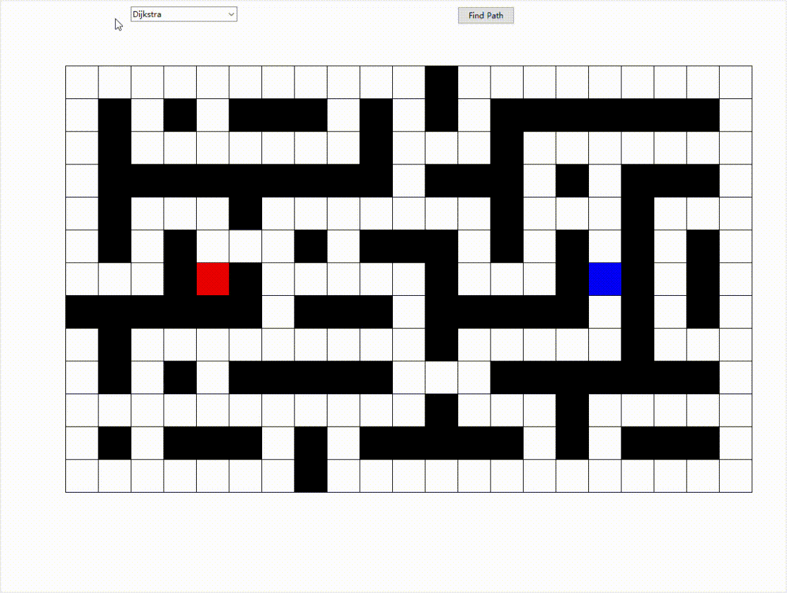

# PathFinder

## Key Feature
* Stack and back track method to create maze
* Dijkstra algorithm
* visualize the path finding process

## Function
* Run and click to see how alogrithm find the shortest path from the start to the end

